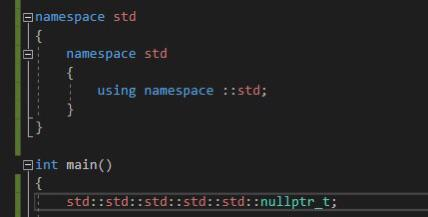

## Hi there I'm Reivaxmar 👋

## Languages & Tools

 
 

## Currently doing...
- [ ] Protein tracker
- [ ] Competitive programming
- [ ] 3D CPU rasterizer
- [ ] Trying out Godot

## Was doing...
- [x] Minesweeper clone
- [x] Head Hero
- [ ] 3D Tic Tac Toe
- [ ] Voice-assisted music player
- [ ] Pokemon clone
<!--
**Reivaxmar/Reivaxmar** is a ✨ _special_ ✨ repository because its `README.md` (this file) appears on your GitHub profile.

Here are some ideas to get you started:

- 🔭 I’m currently working on ...
- 🌱 I’m currently learning ...
- 👯 I’m looking to collaborate on ...
- 🤔 I’m looking for help with ...
- 💬 Ask me about ...
- 📫 How to reach me: ...
- 😄 Pronouns: ...
- ⚡ Fun fact: ...
-->
